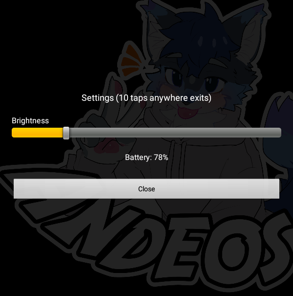

# Convention Badge App

A full-screen Android kiosk app that displays a badge image on boot
and hides the status/nav bars. Single Activity, no XML layouts —
all views are built programmatically in Kotlin.



## Compatibility

The app targets **Android 5.0 (API 21)** and above. It was developed
and tested on an **Android 7.1.2 (API 25)** Amazon Fire tablet
running LineageOS.

## Behavior

- **5 taps anywhere within 3 seconds** → opens a settings popup with
  a screen-brightness slider (0–255) and the current battery percentage.
- **10 taps anywhere within 3 seconds** → exits to the home launcher.
  The tap counter keeps running while the popup is open, so it takes
  5 more taps after opening the popup to exit.
- The popup's **Close** button dismisses it and resets the counter.

### Runtime badge image

No image is bundled in the APK. Place a file named `badge.png` at

```
/sdcard/Android/data/com.andeos.badge/files/badge.png
```

(app-private external storage — no storage permission needed). If the
file is missing or undecodable, a black error overlay with the path and
instructions appears; 10 taps still exits from there.

### System-wide brightness

The slider writes `Settings.System.SCREEN_BRIGHTNESS`. On first open,
a `WRITE_SETTINGS` permission prompt appears — tap once more to confirm
and the system permission screen launches.

### Screen pinning

The app pins itself at launch (`startLockTask`) so the user can't
accidentally leave it. Screen pinning must be enabled once on the
device: **Settings → Security → Screen pinning → On**.

## Build

```
./gradlew assembleDebug
```

Output: `app/build/outputs/apk/debug/app-debug.apk`